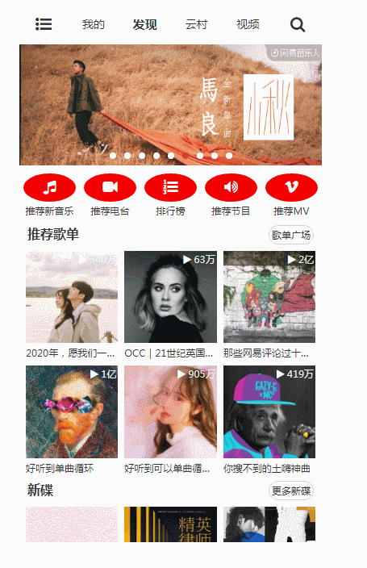
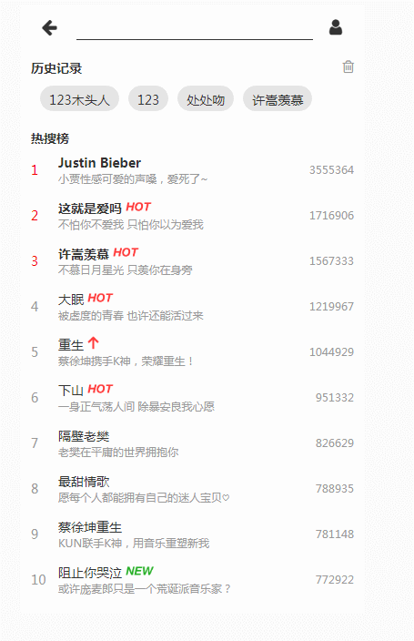
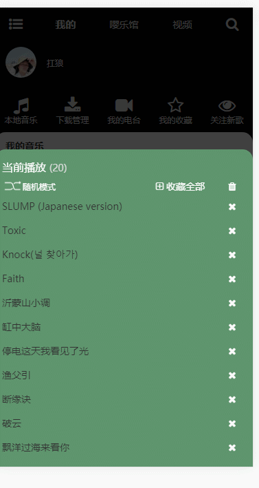
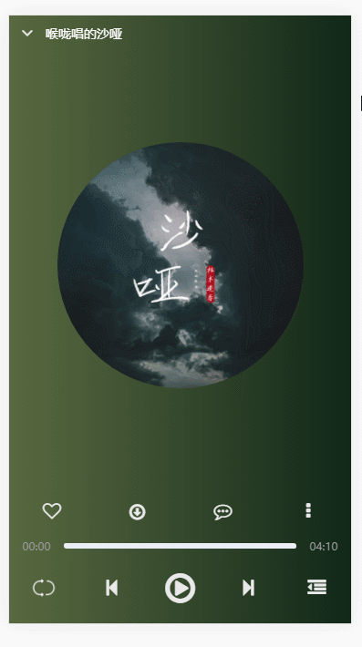

# vue-typescript-music

## Vue+TypeScript better-music-webapp (Music Project)

[中文](./README.md)

**Online access address**  [online address](http://47.93.187.37/)

**Project analysis online** [Source resolution address](https://blog.csdn.net/weixin_42661283/article/details/106552202)

> vue-content-loader [TypeScript Support](https://github.com/egoist/vue-content-loader/pull/13)

> Continuous improvement of projects and ongoing updates...

##### Please Star，Issues

1. **Your star is my driving force for continuous updating and maintenance！！！**
2. **If there are some problems during use, please issue**

> Detailed notes perfect interpretation you deserve
> Zero UI component library, hand-made

### Back end API dependency

`NeteaseCloudMusicApi 3.29.0`

1. [Interface download address](https://github.com/Binaryify/NeteaseCloudMusicApi)
2. [Interface API document address](https://binaryify.github.io/NeteaseCloudMusicApi/#/?id=neteasecloudmusicapi)

### Example renderings
<details>
<summary>Direct access to online address is recommended (the picture file is large and may not be loaded)</summary>







</details>


### Introduction to interface and function module
<details>
<summary></summary>

**Personal page**

- [x] login
- [x] Play history
- [ ] My radio station
- [ ] My star
- [ ] Focus on new songs
- [ ] My music
- [ ] My favorite music


**Default page（Music Hall）**

- [x] banner Rotation chart
- [x] Recommended song list
- [x] New dish
- [ ] Recommended new music
- [ ] Recommended radio station
- [x] Ranking List
- [ ] Recommended programs
- [ ] Recommended MV


**Search page**

- [x] Hot search list
- [x] History
- [x] Singer classification
- [x] Search input box function

**Search result**

- [x] Search results navigation
- [x] Comprehensive
- [x] Single
- [x] Video
- [x] Singer
- [x] Album
- [x] Song sheet
- [x] Radio station
- [x] Uiser

**Singer details**

- [x] Home page
- [x] Album
- [x] Mv

**Comment interface**
- [x] Comment like, cancel like
- [x] Comment
- [x] Reply to comments
- [x] Copy comments
- [x] Delete comment

**Play music**

- [x] Play
- [x] Play up and down
- [x] Slide to switch playback
- [x] Play mode
- [x] Play list
- [x] Star Song sheet
- [x] Delete playlist
- [x] Download currently playing music
- [x] Lyric

**Video page**

`Not yet open`

</details>


---

## Project setup

```
npm install
```

### Compiles and hot-reloads for development

```
npm run serve
```

### Compiles and minifies for production

```
npm run build
```

### Run your tests

```
npm run test
```

### Lints and fixes files

```
npm run lint
```
